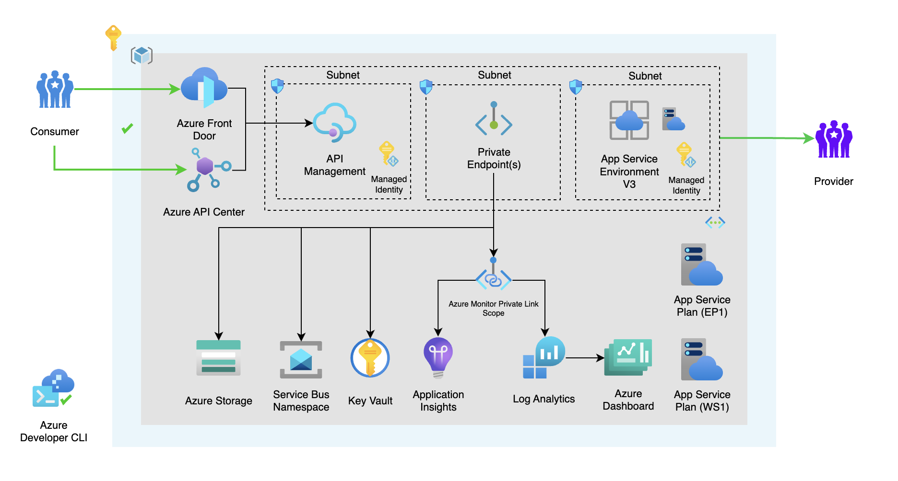

<!-- YAML front-matter schema: https://review.learn.microsoft.com/en-us/help/contribute/samples/process/onboarding?branch=main#supported-metadata-fields-for-readmemd -->

[](https://codespaces.new/Azure/azd-ais-lza)
[](https://vscode.dev/redirect?url=vscode://ms-vscode-remote.remote-containers/cloneInVolume?url=https://github.com/Azure/azd-ais-lza)

<!--
Available as template on:
[](https://aka.ms/awesome-azd)
`azd`
-->
# Deploy Azure Integration Services Landing Zone Accelerator with Azure Developer CLI

Deploy Azure Integration Services Landing Zone accelerator with Azure Developer CLI to create a secure and scalable environment for your integration services. The accelerator includes best practices for security, network isolation, monitoring, and more.

## Key features

- **Infrastructure-as-code**: Bicep templates for provisioning and deploying the resources.
- **Secure Access Management**: Best practices and configurations for managing secure access to Azure Integration Services.
- **Monitoring**: Solutions for tracking and monitoring Azure Integration Services.
- **End-to-end sample**: Including dashboards, policies, isolation, and more.

## Architecture


Read more: [Architecture in detail](#architecture-in-detail)

## Assets

- Infrastructure-as-code (IaC) Bicep files under the `infra` folder that demonstrate how to provision resources and setup resource tagging for azd.
- A [dev container](https://containers.dev) configuration file under the `.devcontainer` directory that installs infrastructure tooling by default. This can be readily used to create cloud-hosted developer environments such as [GitHub Codespaces](https://aka.ms/codespaces) or a local environment via a [VSCode DevContainer](https://code.visualstudio.com/docs/devcontainers/containers).
- Continuous deployment workflows for CI providers such as GitHub Actions under the `.github` directory, and Azure Pipelines under the `.azdo` directory that work for most use-cases.

## Getting started

### Prerequisites

- [Azure Developer CLI](https://docs.microsoft.com/en-us/azure/developer/azure-developer-cli/)
- [Azure CLI](https://docs.microsoft.com/en-us/cli/azure/install-azure-cli)

### 1. Initialize a new `azd` environment

```shell
azd init -t pascalvanderheiden/azd-ais-lza
```

If you already cloned this repository to your local machine or run from a Dev Container or GitHub Codespaces you can run the following command from the root folder.

```shell
azd init
```

It will prompt you to provide a name that will later be used in the name of the deployed resources. If you're not logged into Azure, it will also prompt you to first login.

```shell
azd auth login
```

### 2. Provision and deploy all the resources

```shell
azd up
```

It will prompt you to login, pick a subscription, and provide a location (like "eastus"). We've added extra conditional parameters to deploy: Azure Frontdoor, Application Service Environment v3, Azure Service Bus and Redis Cache. Then it will provision the resources in your account.

For more details on the deployed services, see [additional details](#additional-details) below.

> [!NOTE]  
> Sometimes the DNS zones for the private endpoints aren't created correctly / in time. If you get an error when you deploy the resources, you can try to deploy the resources again.

### 3. Manually enabling optional features after deployment

This repository uses environment variables to configure the deployment, which can be used to enable optional features. You can manually set these variables with the `azd env set` command or by setting them using the the `azd up` command the first time, where they will be asked as conditional parameters. After setting the environment variables, you can run `azd up` to deploy the resources.

```shell
azd env set DEPLOY_FRONTDOOR '<true-or-false>'
azd env set DEPLOY_ASE '<true-or-false>'
azd env set DEPLOY_SERVICEBUS '<true-or-false>'
azd env set USE_REDIS_CACHE_APIM '<true-or-false>'
```

In the azd template, we automatically set an environment variable for your current IP address. During deployment, this allows traffic from your local machine to the App Service Environment for deploying Logic Apps and Function Apps. If you want to use a different IP address, you can set the MY_IP_ADDRESS environment variable.

> [!NOTE]
> Deployment of Azure Redis Cache can take up to 30 minutes.

```shell
azd env set MY_IP_ADDRESS '<your-ip-address>'
```

> [!NOTE]  
> To determine your IPv4 address, the service icanhazip.com is being used. To control the IPv4 addresss used directly (without the service), edit the MY_IP_ADDRESS field in the .azure\<name>\.env file. This file is created after azd init. Without a properly configured IP address, azd up will fail.

## Additional features

### CI/CD pipeline

This project includes a Github workflow and a Azure DevOps Pipeline for deploying the resources to Azure on every push to main. That workflow requires several Azure-related authentication secrets to be stored as Github action secrets. To set that up, run:

```shell
azd pipeline config
```

### Enable AZD support for ADE (Azure Development Environment)

You can configure `azd` to provision and deploy resources to your deployment environments using standard commands such as `azd up` or `azd provision`. When `platform.type` is set to devcenter, all `azd` remote environment state and provisioning uses dev center components. `azd` uses one of the infrastructure templates defined in your dev center catalog for resource provisioning. In this configuration, the infra folder in your local templates isn’t used.

```shell
 azd config set platform.type devcenter
```

### Monitoring

The deployed resources include a Log Analytics workspace with an Application Insights based dashboard to measure metrics like server response time and failed requests.


To open that dashboard, run this command once you've deployed:

```shell
azd monitor --overview
```

### Clean up

To clean up all the resources you've created and purge the soft-deletes, simply run:

```shell
azd down --purge --force
```

The resource group and all the resources will be deleted and you'll not be prompted.

### Testing

A [tests.http](tests.http) file with relevant tests you can perform is included, to check if your deployment is successful. You need the 2 subcription keys for Marketing and Finance, created in API Management in order to test the API. You can find more information about how to create subscription keys [here](https://docs.microsoft.com/en-us/azure/api-management/api-management-howto-create-subscriptions#add-a-subscription-key-to-a-user).

### Build Status

After forking this repo, you can use this GitHub Action to enable CI/CD for your fork. Just adjust the README in your fork to point to your own GitHub repo.

| GitHub Action | Status |
| ----------- | ----------- |
| `azd` Deploy | [](https://github.com/Azure/azd-ais-lza/actions/workflows/azure-dev.yml) |

## Additional Details

The following section examines different concepts that help tie in application and infrastructure.

### Architecture in detail

This repository illustrates how to setup the Azure Integration Services Landing Zone accelerator with Azure Developer CLI. The accelerator includes best practices for security, network isolation, monitoring, and more.

We've used the Azure Developer CLI Bicep Starter template to create this repository. With `azd` you can create a new repository with a fully functional CI/CD pipeline in minutes. You can find more information about `azd` [here](https://learn.microsoft.com/en-us/azure/developer/azure-developer-cli/).

One of the key points of `azd` templates is that we can implement best practices together with our solution when it comes to security, network isolation, monitoring, etc. Users are free to define their own best practices for their dev teams & organization, so all deployments are followed by the same standards.

The best practices we've followed for this architecture are: [Azure Integration Service Landingzone Accelerator](https://github.com/Azure/Integration-Services-Landing-Zone-Accelerator).

When it comes to security, there are recommendations mentioned for securing your Azure API Management instance in the accelerators above. For example, implementing OAuth authentication on the API Management instance. How to implement OAuth authentication on API Management (see [here](https://github.com/pascalvanderheiden/ais-apim-oauth-flow) repository).

We're also using [Azure Monitor Private Link Scope](https://learn.microsoft.com/en-us/azure/azure-monitor/logs/private-link-security#configure-access-to-your-resources). This allows us to define the boundaries of my monitoring network, and only allow traffic from within that network to my Log Analytics workspace. This is a great way to secure your monitoring network.

### Azure API Management

[Azure API Management](https://azure.microsoft.com/en-us/services/api-management/) is a fully managed service that enables customers to publish, secure, transform, maintain, and monitor APIs. It is a great way to expose your APIs to the outside world in a secure and manageable way.

### Managed identities

[Managed identities](https://learn.microsoft.com/en-us/azure/active-directory/managed-identities-azure-resources/overview) allows you to secure communication between services. This is done without having the need for you to manage any credentials.

### Virtual Network

[Azure Virtual Network](https://azure.microsoft.com/en-us/services/virtual-network/) allows you to create a private network in Azure. You can use this to secure communication between services.

### Azure Private DNS Zone

[Azure Private DNS Zone](https://docs.microsoft.com/en-us/azure/dns/private-dns-overview) allows you to create a private DNS zone in Azure. You can use this to resolve hostnames in your private network.

### Application Insights

[Application Insights](https://azure.microsoft.com/en-us/services/monitor/) allows you to monitor your application. You can use this to monitor the performance of your application.

### Log Analytics

[Log Analytics](https://azure.microsoft.com/en-us/services/monitor/) allows you to collect and analyze telemetry data from your application. You can use this to monitor the performance of your application.

### Azure Monitor Private Link Scope

[Azure Monitor Private Link Scope](https://learn.microsoft.com/en-us/azure/azure-monitor/logs/private-link-security#configure-access-to-your-resources) allows you to define the boundaries of your monitoring network, and only allow traffic from within that network to your Log Analytics workspace. This is a great way to secure your monitoring network.

### Private Endpoint

[Azure Private Endpoint](https://docs.microsoft.com/en-us/azure/private-link/private-endpoint-overview) allows you to connect privately to a service powered by Azure Private Link. Private Endpoint uses a private IP address from your VNet, effectively bringing the service into your VNet.

### Azure Redis Cache

[Azure Redis Cache](https://azure.microsoft.com/en-us/services/cache/) allows you to use a secure open source Redis cache. Read this on how we [enable Azure Redis Cache to improve the performance of Azure API Management](https://learn.microsoft.com/en-us/azure/api-management/api-management-howto-cache-external).

### Azure Service Bus

[Azure Service Bus](https://azure.microsoft.com/en-us/services/service-bus/) allows you to use a secure messaging service.

### Azure Front Door

[Azure Front Door](https://azure.microsoft.com/en-us/services/frontdoor/) allows you to use a secure global CDN.

### Azure App Service Environment v3

[Azure App Service Environment](https://azure.microsoft.com/en-us/services/app-service/environment/) allows you to use a secure and isolated environment for running your Logic App or Azure Function App.

### Azure Key Vault

[Azure Key Vault](https://azure.microsoft.com/en-us/services/key-vault/) allows you to store and manage your secrets in a secure way.

### Azure Storage

[Azure Storage](https://azure.microsoft.com/en-us/services/storage/) allows you to store your data in a secure way.
